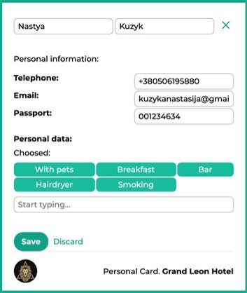

# **ВСТУП**
У наш час важливо, щоб програма була легка у розумінні й використанні. Автоматизована система допомагає користувачу швидше працювати і не витрачати час на розбір документації, щоб зрозуміти як правильно робити певні дії. Тобто інтерфейс і розміщення усіх складових програми повинні бути на своїх місцях й інтуїтивно зрозумілі. Тому важливо підійти до роботи відповідально, щоб користувач був задоволений.

Метою даної роботи є розробка сучасного веб застосунку з мінімальним функціоналом та базою даних MySQL за темою «Готель». В системі підтримуються режими обліку та розподілу за номерами приїжджих гостей в залежності від вимог і побажань мешканців.

Задача полягає у покращенні навичок роботи з мовою програмування Java, також попрацювати з фреймворком Spring та об’єднати всі складові у простий веб застосунок із можливістю перегляду, редагування, додавання та видалення даних.

Завданням було навчитись створювати програму на основі Spring MVC, з реальними даними та використовувати ці дані у створеній програмі, зрозуміти можливості Spring фреймворку та створити власні веб сторінки, передаючи туди дані через REST методи.

Етапи розробки:

- міркування – вивчення своїх потреб під час використання інших програм;
- пошук – знаходження візуалізацій схожих інтерфейсів для розуміння потреб інших користувачів, а також пошук прикладів робочих програм із використанням Spring MVC;
- аналіз – обґрунтування об’єктів, їх взаємозв’язку у роботі та розуміння як контролери взаємодіють з базою даних та програмою в цілому;
- формування – визначення структури програми, що забезпечує утворення певних блоків системи.
- розробка – написання коду та створення веб-сторінок та застосування бази даних.

Таким чином виконується проектування майбутньої програми. Ці етапи розробки дозволяють накопичувати достатньо інформації для подальшої роботи, а також створюють певний план дій для написання інтерфейсу програми та інших її складових, правильно підключити базу даних та сервер.

# **РОЗДІЛ 1. ОПИС СИСТЕМИ**
Система адміністрування готелю розроблена для зручної взаємодії адміністраторів із гостями готелю. Ця програма може бути застосована як для взаємодії гостя із адміністратором віч-на-віч так і для бронювання номеру дистанційно, наприклад за допомогою телефону.

Адміністратор має вповноваження додавати нове бронювання, обираючи дати заїзду, від’їзду гостя, самого гостя, та відповідний номер, враховуючи побажання гостя.

Також адміністратор може додавати нових гостей, заповнюючи дані про них. Необхідно заповнити ім’я, прізвище, контактний номер телефону, номер паспорту та заповнити назву електронної скриньки. Всі ці дані підлягають перевіркам на правильність вводу, а також на унікальність, тобто щоб дані не могли повторюватися.  Особливістю є те, що кожен користувач має право обрати свої побажання, деякі опції, які їм потрібні протягом відвідування, і, в залежності від цих потреб, їм будуть підбиратися кімнати. 

Існує набір цих опцій, з яких користувач може обрати всі йому необхідні:

- «Smoking» – для курців;
- «With children» – для гостей із дітьми;
- «With pets» – для гостей із домашніми тваринами; 
- «Wi-Fi» – для гостей, яким потрібен доступ до бездротового інтернету у номері;
- «Disabled» – гості з обмеженими можливостями, які потребують додаткових допоміжних засобів;
- «Breakfast» – гості, для яких доступний сніданок у готелі;
- «Bar» – для гостей, яким необхідний бар у номері;
- «Hairdryer» – для гостей, який необхідний фен у номері.

В свою чергу кожна кімната має свої опції для гостей, відповідно до яких проходить підбір кімнат:

- «Balcony» - номер із балконом;
- «Bed for children» - номер, що підходить для гостей із дітьми;
- «Conditioner» - номер із кондиціонером;
- «Fridge» - номер з холодильником;
- «Pet friendly» - номер для гостей з домашніми тваринами;
- «Smoke friendly» - номер для курців;
- «TV» - номер з телевізором;
- «Wi-Fi» - номер з бездротовим доступом до інтернету.

Наявна функція редагування інформації про користувача, при чому при редагуванні також наявні перевірки на вірність вводу та на унікальність даних. Можна додавати та видаляти побажання гостей. Гостя також можна видалити, але при цьому видалиться і бронювання закріплене за цим гостем.

Адміністратор може також додавати, редагувати та видаляти номери. Додавання може бути досить корисним при розширенні готелю, редагування мають місце якщо необхідно змінити вартість за ніч в разі подорожчання, або, наприклад, у разі знижок. Номер у готелі можна видалити, у разі проведення ремонтних робіт, або зачинення приміщення по іншим причинам. При видаленні також видаляються усі бронювання за даним номером.

Бронювання створюються наступним чином. Спочатку необхідно обрати дати заїзду та дати від’їзду, є обмеження на вибір дат. Дата заїзду не має бути раніше ніж сьогоднішня дата, відповідно дата від’їзду не має бути раніше, або співпадати з датою заїзду.

Далі маємо обрати користувача. У випадку, якщо вибраний користувач уже забронював у готелі номер на вибрані дати, буде виведене повідомлення про помилку, для того щоб змінити дати, або ж змінити користувача. Потім виконується перехід до списку номерів, що доступні у вибрані дати вибраному користувачу, відповідно до його потреб. Бронювання можна видаляти, але не можна змінювати.

# **РОЗДІЛ 2. ОПИС БАЗИ ДАНИХ**
База даних – сукупність даних, організованих відповідно до концепції, яка описує характеристику цих даних і взаємозв’язки між їх елементами. Дані у базі організовують відповідно до моделі організації даних. Таким чином, сучасна база даних, окрім самих даних, містить їх опис та може містити засоби для їх обробки [1]. 

В загальному випадку базою даних можна вважати будь-який впорядкований набір даних. Система керування базами даних — це система, заснована на програмних та технічних засобах, яка забезпечує визначення, створення, маніпулювання, контроль, керування та використання баз даних. У даній роботі використано MySQL. 

Сучасні СКБД забезпечують функції щодо керування даними, які можна поділити на такі групи: 

·  Оголошення даних — створення, зміна та видалення визначень, які описують організацію даних. 

·  Модифікація даних — додавання даних, їх редагування та видалення. 

·  Отримання даних — надання даних за запитом застосунку у формі, яка дозволяє їх безпосереднє використання. Дані можуть надаватись або у формі, в якій вони зберігаються у базі даних, або в іншій формі 

(наприклад, через поєднання різних даних). 

·  Адміністрування даних — реєстрування та відслідковування дій користувачів, дотримання безпеки роботи з даними, забезпечення надійності та цілісності даних, моніторинг продуктивності, резервне копіювання та відновлення даних тощо. 

## **2.1 Концептуальна модель** 
На початку роботи необхідно визначитись із темою продукту, після чого можна починати створювати схему бази даних, щоб краще зрозуміти як будуть зберігатися дані, спроектувати її за нормальними формами проектування БД. На Рисунку 2.1 зображена концептуальна модель.

Рисунок 2.1. Концептуальна модель бази даних.

## **2.2 Структура бази даних** 
На рисунку 2.2 нижче розглянемо структуру бази даних після створення таблиць у MySQL, а діаграму у IntellijIDEA 2021. 

Рисунок 2.2. Структура бази даних.

На рисунку видно всі залежності й зв’язки між таблицями. Також кожній змінній надані певні характеристики та обмеження. Таким чином побудовано базу даних для майбутнього веб застосунку. Дана модель спроектована за нормальними формами для отримання зручної, простої у розумінні БД, а також щоб уникнути повторень та зайвих змінних. 

Створена база даних складається з 9 таблиць, тому що для правильної роботи з даними краще розмежовувати та створювати декілька невеликих специфічних таблиць, аніж одну велику для всього. Це дозволяє гнучко брати дані за допомогою запитів. За темою є багато критеріїв, які повинні користувачі надати при реєстрації, тому маленькі таблиці саме для зберігання більш детальної інформації для кожного з цих критеріїв. 

Також розроблено один view, для зручного виведення та перегляду даних.

## **2.3 Обмеження цілісності**
Правила цілісності бази даних – це правила, які дають змогу уникнути введення некоректних даних у БД, а також забезпечити можливість зв'язування декількох таблиць. Ці правила можуть бути описані при створенні чи модифікації таблиці [2].

Існують такі типи правил цілісності:

- CHECK – контроль допустимих значень атрибутів;
- NOT NULL/NULL – заборона/дозвіл на використання не заданих або не визначених значень;
- UNIQUE – контроль унікальності значень атрибутів;
- PRIMARY KEY – первинний ключ;
- FOREIGN KEY – зовнішній ключ;
- AUTO\_INCREMENT – автоматичне збільшення на 1, зазвичай використовується для полів ідентифікаторів.

Розглянемо кілька прикладів застосування цих правил на рисунку 2.3-2.5:

Рисунок 2.3. Створення таблиці для номерів.

На рисунку 2.3. зображено створення таблиці номерів та їх типів. Всі поля мають бути обовʼязковими. На ідентифікаційні номери встановлено автоматичне збільшення. На поле вартості номеру за ніч накладені обмеження на невідʼємність ціни. Первинним ключем встановлено ідентифікаційні номери.

У таблиці типів номерів на тип встановлено обмеження унікальності, а також обмеження на мінімальну кількість символів, на опис також встановлено обмеження мінімальної кількості символів.

 

Рисунок 2.4. Створення таблиці гостей.

На рисунку 2.4. зображено створення таблиці гостей. Встановлені відповідні обмеження даних на мінімальну кількість символів, та на унікальність даних.

Рисунок 2.5. Створення таблиці бронювання.

Окрім всіх описаних вище обмежень, зʼявляються нові обмеження на унікальність, або єдиність записів у базі даних. Встановлено, що кімната має бути унікальною на певні дати, таким чином, було унеможливлено забронювати дану кімнату у вже зайняті дати.

Подібним чином встановлено унікальність запису гостя на одні й ті ж самі дати. Мається на увазі, що один гість не має права робити декілька бронювань на одні дати.

Фактично з цією ж метою було створено тригер insert\_booking, зображений на рисунку 2.6. По-перше, він перевіряє на рівні додавання записів у базу даних чи не є дата заʼїзду пізнішою або і є датою відʼїзду.

По-друге, встановлено перевірку зайнятості кімнат, розширюючи обмеження унікальності, встановлені при створенні таблиці бронювання. Таким чином, бронювання не може бути створене на проміжок, у який попадають уже зайняті дати.

Рисунок 2.6. Створення тригеру для встановлення додаткових обмежень на цілісність даних.

На рисунку 2.7 показано додавання зовнішніх ключів, які і є свого рожу звʼязками між таблицями. Необхідно підкреслити, що встановлено додаткову мітку для каскадного видалення даних. Таким чином, наприклад, при видаленні номеру, або гостя, на яких створене бронювання, бронювання автоматичну буде видалене.

Рисунок 2.7. Додавання зовнішніх ключів.
## **2.4 Приклади виведення даних.**
Було створено запити на виведення даних, наприклад, щоб перевірити який номер зайнятий, а який вільний (Рисунок 2.8).

Рисунок 2.8. Виведення результату запиту.

Нижче (Рисунок 2.9, 2.10) показаний приклад запиту щодо перевірки статусу гостя.

Рисунок 2.9. Запит перевірки.

Рисунок 2.10. Результат перевірки.

Було також створено view, спеціальний вид для зручного використання у коді для створення програми (Рисунок 2.11). Він виводить всі необхідні дані для виведення інформації щодо бронювання (Рисунок 2.12, 2.13).

Рисунок 2.11. Запит створення виду для виведення інформації про бронювання.

Рисунок 2.12. Результат виконання запиту, частина 1.

Рисунок 2.13. Результат виконання запиту, частина 2.

# **РОЗДІЛ 3. ОПИС ПРОГРАМНОЇ РЕАЛІЗАЦІЇ**
У цьому розділі буде розглянуто засоби, що були використані у ході роботи, а також загальний вигляд створеного додатку.
## **3.1 Використане програмне забезпечення**
На початку роботи було обрано MySQL для роботи з даними. Це вільна система керування реляційними базами даних. За допомогою лабораторних робот за цей семестр було освоєно дану програму і можна було починати створювати свої додатки з додаванням бази даних [3].

Програмувати на мові Java зручно у середовищі Intellij IDEA. Це інтегроване середовище розробки для різних мов програмування від компанії JetBrains [4].

Далі для створення веб додатку як MVC система було обрано Spring фреймворк, який часто використовується для програмування на мові Java.

Spring – це програмний каркас (фреймворк) з відкритим кодом та контейнери з підтримкою інверсії управління для платформи Java. Основні особливості Spring Framework можуть бути використані будь-яким додатком Java, але є розширення для створення веб-додатків на платформі Java EE.

Продукт створюється на основі maven платформі. Apache Maven — це засіб автоматизації роботи з програмними проєктами. Використовується для управління та складання програм. За принципами роботи кардинально відрізняється від Apache Ant, та має простіший вигляд щодо build-налаштувань, яке надається в форматі XML. XML-файл описує проєкт, його зв'язки з зовнішніми модулями і компонентами, порядок будування (build), папки та необхідні плагіни. Сервер із додатковими модулями та додатковими бібліотеками розміщується на серверах.

Сервером буде виступати Apache Tomcat – контейнер сервлетів, розроблений Apache Software Foundation. Повністю написаний мовою програмування Java та реалізує специфікацію сервлетів і Java Server Pages від Sun Microsystems, що є стандартами для розробки веб-застосунків на Java.

Thymeleaf - це JavaXML/XHTML/HTML5 шаблонізатор, який може працювати як у веб (на основі сервлета), так і не в веб-середовищі. Він краще підходить для обслуговування XHTML/HTML5 на рівні представлення веб- застосунків на основі MVC, але він може обробляти будь-який файл XML навіть в автономних середовищах. Він забезпечує повну інтеграцію Spring Framework.

У веб-застосунках Thymeleaf прагне повністю замінити JavaServer Pages (JSP) і реалізує концепцію Natural Templates: файли шаблонів, які можна відкривати безпосередньо в браузерах і які все ще відображаються правильно як веб-сторінки.

Spring допомагає швидше створювати проект. Цей фреймворк використовує багато анотацій. Нижче наведені деякі з них.

@Component – анотація для будь-якого компонента фреймворку.

@Service – показує, що цей клас представляє собою сервіс – компонент сервіс-слою. Сервіс являє собою підтипом класу @Component. Використання даної анотації дозволяє шукати біни-сервіси автоматично.

@Repository – показує, що клас функціонує як репозиторій і вимагає наявлення зрозумілої трансляції виключень, помилок. Перевагою трансляції винятків є те, що шар сервісу матиме справу із загальною ієрархією винятків від Spring (DataAccessException) незалежно від використовуваних технологій доступу до даних у шарі даних.

@Controller – для маркування java класу як класу контролера. Цей клас є компонент, схожий на звичайний сервлет (HttpServlet) (працюючий з об'єктами HttpServletRequest і HttpServletResponse), але з розширеними можливостями від Spring Framework.

@ResponseBody – показує, що даний метод може повертати кастомний об'єкт у вигляді xml, json.

@RestController – акумулює поведінку двох анотацій @Controller та @ResponseBody.

@Transactional – перед виконанням методу позначеного даною анотацією починається транзакція, після виконання методу транзакція комітується, при викиданні RuntimeException відкочується.

@Autowired – дозволяє автоматично встановити значення поля.

@RequestMapping – використовується для мапінг адреси запиту на вказаний метод або клас. Можна вказувати конкретний HTTP-метод, який оброблятиметься (GET/POST), передавати параметри запиту.

@ModelAttribute – зв'язує параметр методу або значення методу, що повертається, з атрибутом моделі, яка буде використовуватися при виведенні jsp- сторінки.

@PathVariable – показує, що параметр методу повинен бути пов'язаний зі змінною з адреси.

@Scope – допомагає встановити область життя біна: singleton (тільки один екземпляр біна створюється для IoC контейнера; значення за замовчуванням ), prototype (створюється новий екземпляр біна коли надходить запит на його створення), request (один екземпляр біна для кожного HTTP запиту ), session (один екземпляр біна для кожної сесії), globalSession (один екземпляр біна для кожної глобальної сесії).

@PostConstruct – для методу, який буде викликаний після виклику конструктора Біна.

@PreDestroy – для методу, який буде викликаний перед знищенням біну.

@Profile – для створення профілів конфігурації проекту. Може застосовуватися як до бінів так і до конфігураційних класів.

У головному файлі для запуску програми треба викликати конструктор одного з нижче наведених класів, у залежності від реалізації конфігурації.

FileSystemXmlApplicationContext: Завантажує визначення бінів з контекстного файлу який розташований у файловій системі.

ClassPathXmlApplicationContext: Шукає файл контексту в CLASSPATH.

WebXmlApplicationContext: Шукає контекстний файл у веб-програмі.

Розділення проекту на класи дає змогу швидше знайти бажану функцію чи місце коду, створює більш зрозумілий вигляд програми. Саме це називається гарною архітектурою програми. Це дуже допомагає у великих проектах не губитися у тисячах строках коду в одному файлі і не створювати «рушник» коду.

Архітектура програмного забезпечення – це структура програми, яка включає програмні компоненти, видимі зовні властивості цих компонентів, а також відносини між ними [5].

Для отримання, видалення, редагування записів з бази даних необхідно у методі писати певний запит (query).

Завданням є створення REST контролерів, що розшифровується як REpresentational State Transfer. Відмінною особливістю сервісів REST є те, що вони дозволяють якнайкраще використовувати протокол HTTP.
## **3.2 Структура інформаційної системи**
На Рисунку 3.1 зображена файлова структура проекту. Основний пакет проекту названо ua.kpi.anastasiia. Далі, створено пакети для розмежування класів по спектру дії: 

- config – класи для конфігурування проекту;
- controllers – основні класи контролю;
- validators – підпакет пакету контролерів, який вміщає валідацію полів;
- dao – класи, створені по принципу Data access objet, для роботи з запитами з бази даних;
- mappers – підпакет пакету dao, створений для правильного заповнення запитів даними;
- exceptions – пакет для створення користувацьких виключень;
- models – пакет для опису табличних полів, валідації та модифікації полів.

У пакеті проекту webapp знаходиться підпакет WEB-INF з пакетами resources, який як і пакет views, відповідають за відображення, тобто за досвід користування веб додатком. 

Папка resources вміщає такі папки:

- css – для розміщення каскадних таблиць стилів;
- img – з необхідними зображеннями;
- js – файли взаємодії на java script.

Папка views містить в собі HTML з використанням Thymeleaf для динамічного відображення вмісту:

- booking – сторінки для відображення та модифікації бронювання;
- guests – сторінки для відображення та модифікації гостей;
- rooms - сторінки для відображення та модифікації номерів.

Рисунок 3.1. Файлова структура проекту.
## **3.3 Інтерфейс додатку.**
### **3.3.1 Головна сторінка – бронювання.**
На рисунку 3.2. зображено головну сторінку додатку – бронювання номерів у готелі. На лівій боковій панелі можна побачити логотип готелю, під яким розташоване навігаційне інтерактивне меню сайту. Головна сторінка знаходиться по адресі «/». На основній частині відображаються бронювання, що існують в системі.

Рисунок 3.2. Головна сторінка додатку.

Рисунок 3.3. Список бронювань.

На рисунку 3.3 детальніше зображено список бронювань, тут можна побачити інформацію про користувача, а саме: повне імʼя, електронну пошту, номер телефону, номер паспорту, а також вподобання гостя. 

Виведена інформація щодо перебування користувача у готелі, а саме: дата заїзду та відʼїзду, номер у якому зупинився гість, тип номеру, та загальна вартість за перебування у готелі.

Додатково можна переглянути профіль гостя, але опис сторінок з гостями буде згодом. Можна видалити бронювання, за бажанням.

Натискаючи на кнопку «Book room» переходимо у вікно створення бронювання, зображене на Рисунку 3.4.

3.4. Сторінка створення нового бронювання.

Далі необхідно заповнити дані візиту, а саме: дата прибуття та дата відʼїзду і обрати із випливаючого списку гостя. Дата заїзду не має бути раніше ніж сьогоднішня дата, відповідно дата від’їзду не має бути раніше, або співпадати з датою заїзду, інакше користувачу буде виведено помилку про невірність вводу даних. У випадку, якщо вибраний користувач уже забронював у готелі номер на вибрані дати, буде виведене повідомлення про помилку, для того щоб змінити дати, або ж змінити користувача (Рисунок 3.5). 

Рисунок 3.5. Форма створення бронювання, частина 1.

Потім виконується перехід до списку номерів, що доступні у вибрані дати вибраному користувачу, відповідно до його потреб (Рисунок 3.6).

Рисунок 3.6. Форма створення бронювання, частина 2.

Після натискання на кнопку «Save», бронювання успішно додається, можна побачити новий запис у таблиці (Рисунок 3.7)

Рисунок 3.7. Додане бронювання.
### **3.3.1 Сторінка з гостями.**
На рисунку 3.8 зображено сторінку з гостями, що знаходиться за адресою «/guests». Бачимо список гостей з інформацією про кожного, можливий перегляд (Рисунок 3.9), додавання (Рисунок 3.10), видалення та оновлення (Рисунок 3.11) даних про користувачів.

Рисунок 3.8. Сторінка з гостями.

Рисунок 3.9. Перегляд інформації про користувача.

Рисунок 3.10. Редагування даних користувача.

Рисунок 3.11. Створення нового користувача.

Також, можливий пошук за інформацією про користувача (Рисунок 3.12). У випадку якщо за пошуком нічого не знайдено, про це буде повідомлено користувача (Рисунок 3.13).

Рисунок 3.12. Пошук користувача за даними.

Рисунок 3.13. За пошуком нічого не знайдено.
### **3.3.1 Сторінка з номерами.**
На сторінці з номерами (Рисунок 3.14) маємо список усіх номерів, з можливими опціями, типом номеру та вартістю за ніч. Можливий перегляд (Рисунок 3.15), додавання (Рисунок 3.16), видалення та оновлення (Рисунок 3.17) номерів.

Рисунок 3.14. Сторінка з номерами.

Рисунок 3.15. Перегляд номеру.

Рисунок 3.16. Редагування номеру.

Рисунок 3.17. Додавання нового номеру.

# **ВИСНОВКИ**
У ході виконання курсової роботи були застосовані основні навички роботи з базами даних, мовою розробки Java, а також фреймворком Spring для створення веб-додатків.

Було досягнуто мети створення автоматизованої MVC програми для адміністрування готелем, де можна редагувати, додавати, видаляти та переглядати дані з бази даних, що дозволяє адміністратору з легкістю виконувати основні потреби. Відпрацьовано власні алгоритми та методи виконання роботи.

Ця програма є достатньо повним прикладом для подальшого створення таких систем та роботою з базою даних, сервером та робою з даними через запити у REST контролерах.

Під час даної роботи були застосовані основні можливості мови програмування Java, а також Spring фреймворку, який допомагає з легкістю створювати веб-додатки. Ці знання можуть стати корисними у подальшій роботі з мовами програмування, адже такі веб-застосунки часто проектуються і на інших мовах програмування.
**

# **СПИСОК ВИКОРИСТАНИХ ДЖЕРЕЛ**
\1. Організація баз даних: практичний курс: Навч. посіб. для студ. / А. Ю. Берко, О. М. Верес; Нац. ун-т «Львів. політехніка». — Л., 2003. — 149 c.

\2. Совєтов Б. Я. Бази даних / Б. Я. Совєтов, В. В. Цехановський, В. Д. Чертовський. – Санкт-Петербург, 2015. – 420 с.

\3. MySQL [Електронний ресурс]. – 2019. – Режим доступу до ресурсу: http://blogerator.org/page/mysql-na-steroidah.

\4. Intellij IDEA [Електронний ресурс]. – 2019. – Режим доступу до ресурсу: https://www.jetbrains.com/idea/.

\5. Лаврищева К. М. Підручник «Програмна інженерія» / Катерина Михайлівна Лаврищева. – Київ, 2008. – 90 с.

\6. Thymeleaf [Електронний ресурс] – Режим доступу до ресурсу: https://www.thymeleaf.org/.

\7. Spring tutorial [Електронний ресурс] – Режим доступу до ресурсу: https://www.baeldung.com/spring-tutorial.

\8. Що таке Spring фреймворк? [Електронний ресурс] – Режим доступу до ресурсу: https://habr.com/ru/post/490586/.

\9. Офіційний сайт з документацією Spring [Електронний ресурс] – Режим доступу до ресурсу: https://spring.io/.

\10. Spring Framework [Електронний ресурс] – Режим доступу до ресурсу: https://ru.wikipedia.org/wiki/Spring\_Framework.

2

